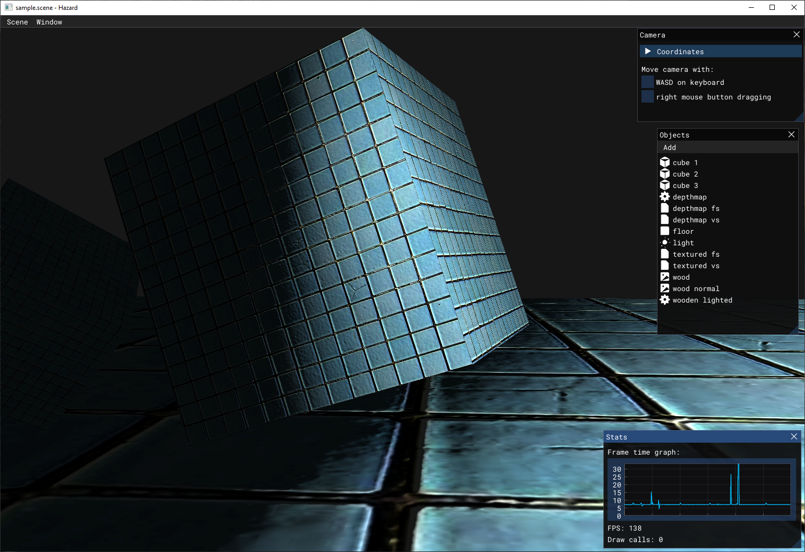

# hazard

A toy graphics engine for rendering learning purposes. Under heavy construction.

Does not utilize any OS specific features but developend and tested only under Windows.



### Technologies and dependencies

* OpenGL 4.5+
* CMake 3.17+
* Dear Imgui (+ several 3rd party plugins for it)
* vcpkg with JSON manifests support

### Build

```shell
# Fetch and install vcpkg dependencies
.\tools\bootstrap.bat

# Build
mkdir build
cd build
cmake ..
```
